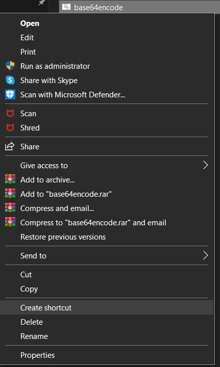
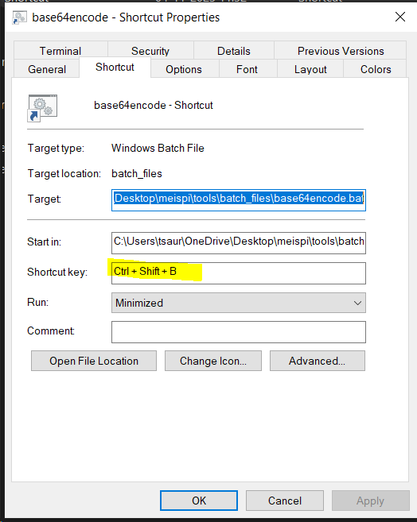

These are some small scripts to create hotkeys for small tasks (such as encoding decoding).
To use these scripts

```
git clone https://github.com/meispi/shortcuts
```

create a batch script (.bat file) with these instructions
```
@echo off
python your\path\to\shortcuts\base64encode.py
```

create a shortcut of this .bat file in the same directory as the .bat file



go to properties of the shortcut file and write your hot key for this task by pressing those keys in the shortcut section



then click apply